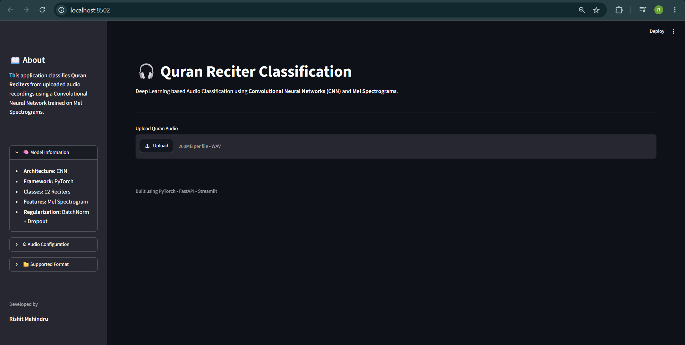
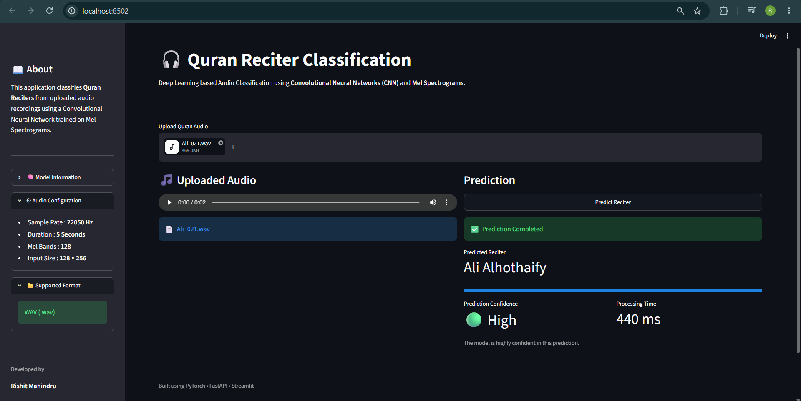
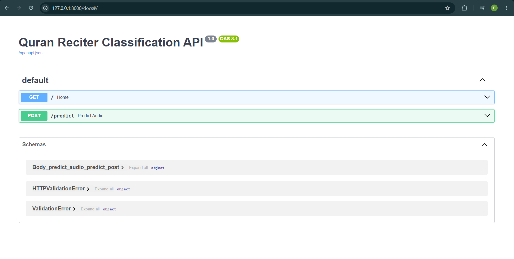
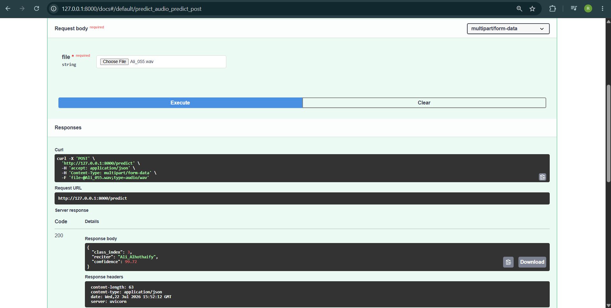
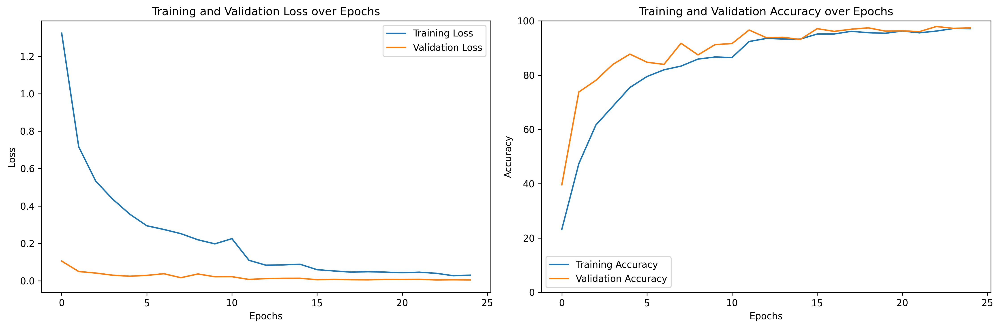
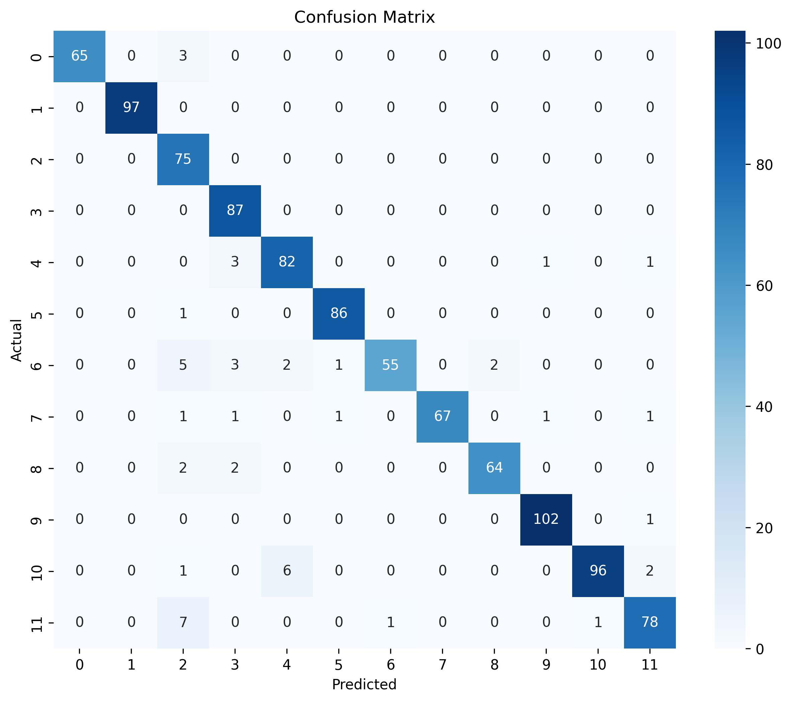

<div align="center">

# 🎙️ Quran Reciter Audio Classification

### End-to-End Deep Learning Project using PyTorch, Streamlit, FastAPI & Docker

</div>

<div align="center">


</div>

---

## 📖 Project Overview

This project is a complete **end-to-end Deep Learning application** that automatically identifies the **Quran reciter** from an uploaded audio recording.

Unlike traditional machine learning approaches that rely on handcrafted audio features, this project leverages **Convolutional Neural Networks (CNNs)** trained on **Mel Spectrograms**, enabling the model to learn discriminative audio patterns directly from speech.

The project demonstrates the complete AI development lifecycle:

- 🎵 Audio preprocessing
- 📊 Mel Spectrogram generation
- 🧠 CNN model training
- 📈 Model evaluation
- ⚡ REST API development with FastAPI
- 🌐 Interactive Streamlit web application
- 🤗 Hugging Face model hosting
- 🐳 Docker containerization
- ☁️ Cloud deployment on Streamlit Community Cloud

The deployed application allows users to upload an audio file and receive:

- Predicted Quran Reciter
- Confidence Level
- Fast inference using the trained CNN model

---
## 📑 Table of Contents

- [🚀 Live Demo](#-live-demo)
- [🤗 Model](#-model)
- [✨ Features](#-features)
- [🎯 Supported Reciters](#-supported-reciters)
- [🛠 Tech Stack](#-tech-stack)
- [📂 Project Structure](#-project-structure)
- [⚙️ How the Project Works](#️-how-the-project-works)
- [🎵 Audio Preprocessing Pipeline](#-audio-preprocessing-pipeline)
- [🧠 CNN Model Architecture](#-cnn-model-architecture)
- [📊 Model Training](#-model-training)
- [📈 Model Performance](#-model-performance)
- [🔄 Prediction Workflow](#-prediction-workflow)
- [🏗 Deployment Architecture](#-deployment-architecture)
- [🚀 Installation](#-installation)
- [▶️ Running the Streamlit Application](#️-running-the-streamlit-application)
- [⚡ Running the FastAPI Server](#-running-the-fastapi-server)
- [🐳 Docker Support](#-docker-support)
- [📡 FastAPI Endpoints](#-fastapi-endpoints)
- [📷 Application Screenshots](#-application-screenshots)
- [📊 Training Results](#-training-results)
- [📈 Model Highlights](#-model-highlights)
- [🔮 Future Improvements](#-future-improvements)
- [👨‍💻 Author](#-author)

# 🚀 Live Demo

### 🌐 Streamlit Application

https://audio-classification-fq9stimzzgt6yjb7edivlj.streamlit.app/

---

# 🤗 Model

The trained PyTorch model is hosted on Hugging Face Hub and is downloaded automatically during inference.

**Repository**

https://huggingface.co/Rishit925/Audio-Classification

---

# ✨ Features

✅ Upload Quran recitation audio

✅ Automatic Mel Spectrogram generation

✅ CNN-based audio classification

✅ Predicts one of **12 Quran Reciters**

✅ Confidence estimation

✅ Interactive Streamlit interface

✅ FastAPI REST API

✅ Swagger API Documentation

✅ Docker support

✅ Hugging Face model downloading

✅ Cloud deployment

---

# 🎯 Supported Reciters

The model classifies audio into the following twelve reciters:

| Class ID | Quran Reciter |
|-----------|---------------|
| 0 | Abdul Basit |
| 1 | Abdul Rahman Al-Sudais |
| 2 | Abdullah Awad Al Juhany |
| 3 | Ali Al Hudhaify |
| 4 | Ibrahim Al Akhdar |
| 5 | Maher Al Muaiqly |
| 6 | Mishary Rashid Alafasy |
| 7 | Muhammad Ayyub |
| 8 | Saad Al Ghamdi |
| 9 | Saud Al Shuraim |
| 10 | Yasser Al Dosari |
| 11 | Salah Al Budair |

---

# 🛠 Tech Stack

| Category | Technologies |
|------------|-----------------------------|
| Language | Python 3.11 |
| Deep Learning | PyTorch |
| Audio Processing | Librosa |
| Visualization | Matplotlib |
| Data Handling | NumPy, Pandas |
| API | FastAPI |
| Frontend | Streamlit |
| Model Hosting | Hugging Face Hub |
| Containerization | Docker |
| Version Control | Git & GitHub |

---

# 📂 Project Structure

```
Audio-Classification/
│
├── app/
│   ├── main.py                 # Streamlit application
│   ├── predict.py              # Prediction pipeline
│   ├── preprocess.py           # Audio preprocessing
│   ├── model.py                # CNN architecture
│   ├── config.py               # Configuration & Hugging Face model loading
│   ├── class_names.py          # Reciter class labels
│   └── assets/
│
├── api/
│   ├── main.py                 # FastAPI application
│   └── routes.py               # API endpoints
│
├── notebook/
│   ├── training.ipynb
│   └── EDA.ipynb
│
├── Dockerfile
├── requirements.txt
├── README.md
└── .dockerignore
```

---

# ⚙️ How the Project Works

The complete inference pipeline consists of multiple stages, starting from audio upload to final prediction.

```
             Audio Upload
                   │
                   ▼
         Audio Preprocessing
                   │
                   ▼
        Mel Spectrogram Generation
                   │
                   ▼
         Image Normalization
                   │
                   ▼
       Convolutional Neural Network
                   │
                   ▼
          Softmax Probability
                   │
                   ▼
      Predicted Quran Reciter
```

---

# 🎵 Audio Preprocessing Pipeline

Before training or prediction, every uploaded audio file undergoes several preprocessing steps to ensure consistent input quality.

### Step 1 — Load Audio

The uploaded `.mp3` or `.wav` file is loaded using **Librosa**.

---

### Step 2 — Resampling

Audio is resampled to a fixed sampling rate to maintain consistency across all recordings.

---

### Step 3 — Duration Standardization

Each audio clip is either:

- Trimmed if longer than the required duration
- Zero padded if shorter

This guarantees a fixed-length input for the CNN.

---

### Step 4 — Mel Spectrogram Generation

The processed audio waveform is transformed into a **Mel Spectrogram**, which represents frequency information over time.

Unlike raw waveforms, Mel Spectrograms capture speech characteristics more effectively and are widely used in audio classification tasks.

---

### Step 5 — Normalization

The generated spectrogram is normalized before being passed into the CNN model.

This improves training stability and model convergence.

---

# 🧠 CNN Model Architecture

The model is a custom-built **Convolutional Neural Network (CNN)** developed using **PyTorch**.

The CNN automatically learns hierarchical audio representations directly from Mel Spectrogram images.

## Architecture Overview

```
Input Mel Spectrogram
        │
        ▼
Conv2D
        │
ReLU
        │
MaxPooling
        │
▼
Conv2D
        │
ReLU
        │
MaxPooling
        │
▼
Conv2D
        │
ReLU
        │
MaxPooling
        │
▼
Flatten
        │
▼
Fully Connected Layer
        │
▼
Fully Connected Layer
        │
▼
Output Layer (12 Classes)
```

The final layer produces probability scores for all twelve Quran reciters.

The reciter with the highest probability is returned as the final prediction.

---

# 📊 Model Training

The CNN was trained on Mel Spectrogram images generated from Quran recitation audio.

During training:

- Audio files were converted into Mel Spectrograms.
- Images were resized to a fixed resolution.
- Training and validation datasets were created.
- Cross-Entropy Loss was used as the objective function.
- Adam optimizer was used for optimization.
- Model checkpoints were saved based on validation performance.

The model achieving the highest validation accuracy was selected for deployment.

---

# 📈 Model Performance

| Metric | Value |
|----------|---------|
| Training Accuracy | **≈97%** |
| Validation Accuracy | **≈98%** |
| Classes | 12 |
| Framework | PyTorch |
| Input | Mel Spectrogram |
| Output | Quran Reciter |

The model demonstrates strong generalization capability on unseen recitation audio while maintaining high prediction confidence.

---

# 🔄 Prediction Workflow

When a user uploads an audio file through the Streamlit interface, the following operations are performed automatically.

```
Upload Audio
      │
      ▼
Temporary Audio File
      │
      ▼
Audio Preprocessing
      │
      ▼
Mel Spectrogram Generation
      │
      ▼
CNN Model Inference
      │
      ▼
Softmax Probability
      │
      ▼
Predicted Reciter
      │
      ▼
Display Confidence Score
```

The trained model is automatically downloaded from **Hugging Face Hub** during application startup, eliminating the need to bundle the large model file inside the repository.

---

# 🏗️ Deployment Architecture

```
                User

                  │

                  ▼

      Streamlit Web Application

                  │

                  ▼

        Prediction Pipeline

                  │

                  ▼

     Hugging Face Model Download

                  │

                  ▼

       PyTorch CNN Inference

                  │

                  ▼

     Predicted Quran Reciter
```

This architecture keeps the GitHub repository lightweight while enabling seamless deployment on Streamlit Community Cloud.

---

# 🚀 Installation

Clone the repository:

```bash
git clone https://github.com/Rishit925/Audio-Classification.git
```

Move into the project directory:

```bash
cd Audio-Classification
```

Create a virtual environment (recommended):

```bash
python -m venv venv
```

Activate it:

### Windows

```bash
venv\Scripts\activate
```

### Linux / macOS

```bash
source venv/bin/activate
```

Install all dependencies:

```bash
pip install -r requirements.txt
```

---

# ▶️ Running the Streamlit Application

Run the application locally:

```bash
streamlit run app/main.py
```

Open your browser at:

```
http://localhost:8501
```

The application will automatically download the trained model from Hugging Face during its first startup.

---

# ⚡ Running the FastAPI Server

Start the API:

```bash
uvicorn api.main:app --reload
```

API Documentation:

```
http://127.0.0.1:8000/docs
```

Interactive Swagger documentation is available automatically.

---

# 🐳 Docker Support

Build the Docker image:

```bash
docker build -t audio-classification .
```

Run the container:

```bash
docker run -p 8501:8501 audio-classification
```

Open:

```
http://localhost:8501
```

---

# 📡 FastAPI Endpoints

| Method | Endpoint | Description |
|----------|----------|-------------|
| GET | `/` | Health Check |
| POST | `/predict` | Predict Quran Reciter |

---

# 📷 Application Screenshots

## 🏠 Home Page



---

## 🎙 Prediction Result



---

## 📖 FastAPI Swagger Documentation



<br>



---

# 📊 Training Results

## Accuracy & Loss Curve



---

## Confusion Matrix



---

# 📈 Model Highlights

- Custom CNN architecture built using PyTorch
- Trained on Mel Spectrogram representations
- Approximately **98% Validation Accuracy**
- Supports classification of **12 Quran Reciters**
- Automatic model downloading from Hugging Face
- Interactive Streamlit interface
- FastAPI backend with Swagger UI
- Dockerized deployment
- Cloud deployment using Streamlit Community Cloud

---

# 🔮 Future Improvements

Some possible future enhancements include:

- Support for additional Quran reciters
- Larger and more diverse training dataset
- Audio trimming directly in the web application
- Top-3 prediction probabilities
- Grad-CAM visualization for explainability
- ONNX/TorchScript model optimization
- GPU inference support
- Batch audio prediction
- User authentication for API access

---

# 👨‍💻 Author

**Rishit Mahindru**

### Connect with me

- GitHub: https://github.com/Rishit925
- LinkedIn: *(Add your LinkedIn profile here)*

---

# ⭐ If you found this project useful

If you enjoyed this project or found it helpful:

⭐ Star the repository

🍴 Fork it

🛠️ Contribute with improvements

Sharing feedback and suggestions is always appreciated!

---